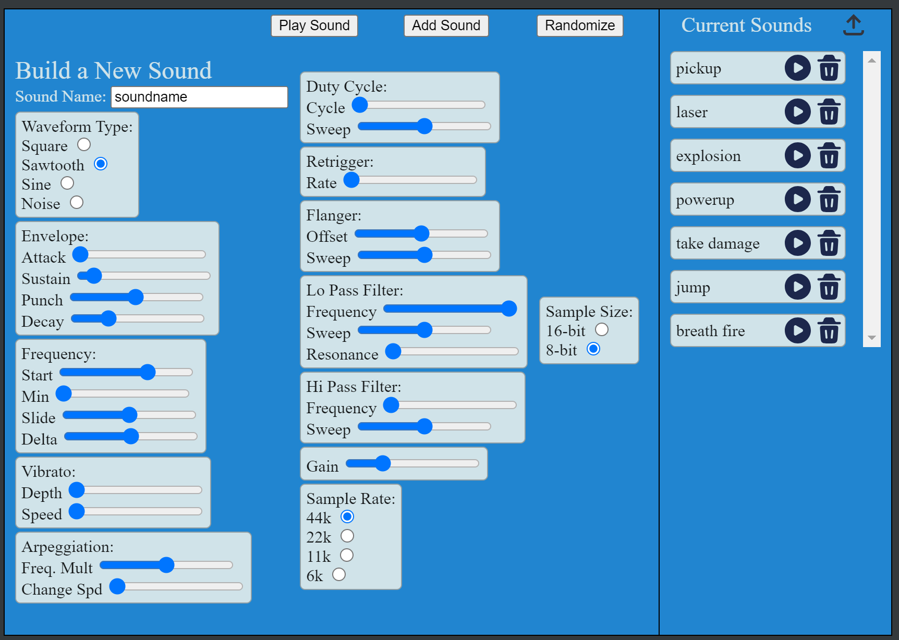

###### Readme top

<br />
<div align="center">
  <a href="http:\\excaliburjs.com">
    
  </a>

  <h3 align="center">Demo of Excalibur-JSFXR Plugin</h3>

  <p align="center">
    This is a quick demo project that uses the Excalibur-JSFXR Plugin to Create, Store, and Play generated sound effects!
    <br />
    
  </p>
</div>

<!-- TABLE OF CONTENTS -->
<details>
  <summary>Table of Contents</summary>
  <ol>
    <li><a href="#about-the-demo">About The Demo</a></li>
    <li><a href="#demo-ui">Demo UI</a></li>
    <li><a href="#getting-started">Getting Started</a></li>
    <li><a href="#sound-configs">Sound Configs</a></li>
    <li><a href="#playing-sounds">Playing Sounds</a>
      <ul>
        <li><a href="#playing-a-stored-sound">Playing a stored sound</a></li>
        <li><a href="#playing-an-ad-hoc-configuration">Playing an ad hoc configuration</a></li>
      </ul>
    </li>
    <li><a href="#types">Types</a></li>
    <li><a href="#utility-methods">Utility Methods</a></li>
    <li><a href="#contact">Contact</a></li>
    <li><a href="#acknowledgments">Acknowledgments</a></li>
  </ol>
</details>

<!-- ABOUT THE PROJECT -->

## About The Demo

This demo imports the Excalibur-JSFXR plugin, which creates a class that stores the configured sound config objects, but also let's the
user play those sound configs directly to the web audio API.

This demo essentially is a clone of the original project that inspired the demo.

[JSFXR Project](https://sfxr.me/)

The demo can:

- Allow user to create new sound configurations
- Allow user to store created sound configurations
- Allow user to export a sounds.ts file with all the stored sound configurations automatically generated.

## Made with:

- Excalibur
- Excalibur-JSXFR plugin
- Peasy-UI

<p align="right">(<a href="#readme-top">back to top</a>)</p>

## Demo UI



The left side of the demo has all the radio buttons and sliders needed to manipulate the sound parameters. This includes buttons
designated as 'Play', 'Add Sound', and 'Randomize'

The 'Play' button will send the current configuration to the JSFX library.

The 'Add Sound' button captures the sound configuration and stores it in the plugin store.

The 'Randomize' button carefully crafts an appropriate set of parameters to create a random sound.

The right side of the demo represents what is currently stored in the plug-in store of sound configs.

These can be 'replayed' and 'deleted' with the buttons on each sound config element.

In the very top right is the export button.

This will export a 'sounds.ts' file to your downloads folder, all ready to inport into your project.

<p align="right">(<a href="#readme-top">back to top</a>)</p>

<!-- GETTING STARTED -->

## Getting Started

To import the plug-in, from your shell:

```sh
npm i @excaliburjs/plugin-jsfxr
```

Declare and instantiate the new module and initialize

```ts
import { JsfxrResource, SoundConfig } from "@excaliburjs/excalibur-jsfxr";
import { sounds } from "./sounds";

let sndPlugin = new JsfxrResource();
sndPlugin.init(); //initializes the JSFXR library
for (const sound in sounds) {
  sndPlugin.loadSoundConfig(sound, sounds[sound]);
}
```

<p align="right">(<a href="#readme-top">back to top</a>)</p>

## Sound Configs

As you may notice, we are loading sound configurations from sounds.ts in the example above. Let's take a quick look at an example from
sounds.ts

```ts
import { SoundConfig } from "@excaliburjs/excalibur-jsfxr";
export const sounds: { [key: string]: SoundConfig } = {};

sounds["pickup"] = {
  oldParams: true,
  wave_type: 1,
  p_env_attack: 0,
  p_env_sustain: 0.02376922019231107,
  p_env_punch: 0.552088780864157,
  p_env_decay: 0.44573175628456596,
  p_base_freq: 0.6823818961421457,
  p_freq_limit: 0,
  p_freq_ramp: 0,
  p_freq_dramp: 0,
  p_vib_strength: 0,
  p_vib_speed: 0,
  p_arp_mod: 0,
  p_arp_speed: 0,
  p_duty: 0,
  p_duty_ramp: 0,
  p_repeat_speed: 0,
  p_pha_offset: 0,
  p_pha_ramp: 0,
  p_lpf_freq: 1,
  p_lpf_ramp: 0,
  p_lpf_resonance: 0,
  p_hpf_freq: 0,
  p_hpf_ramp: 0,
  sound_vol: 0.25,
  sample_rate: 44100,
  sample_size: 16,
};
```

<p align="right">(<a href="#readme-top">back to top</a>)</p>

## Playing Sounds

There are two ways to get the plugin to play a noise...

### Playing a stored sound

After you've stored your configs in the plugin, you can call the name of the config from the plug-in method `playSound(name: string)`

```ts
sndPlugin.playSound("laser");
```

### Playing an ad hoc configuration

If you do this manually, your heading for some pain, there are tools that can do this for you, and I'll share those briefly.

the Plugin has a playConfig() method that accepts a SoundConfig object, and it will play it immediately.

```ts
const tempSound: SoundConfig = {
  oldParams: true,
  wave_type: wavetype,
  p_env_attack: m.attack.value,
  p_env_sustain: m.sustain.value,
  p_env_punch: m.punch.value,
  p_env_decay: m.decay.value,
  p_base_freq: m.fstart.value,
  p_freq_limit: m.fmin.value,
  p_freq_ramp: m.fslide.value,
  p_freq_dramp: m.fdelta.value,
  p_vib_strength: m.vibDepth.value,
  p_vib_speed: m.vibSpeed.value,
  p_arp_mod: m.arpMult.value,
  p_arp_speed: m.arpChange.value,
  p_duty: dutycycle,
  p_duty_ramp: dutyramp,
  p_repeat_speed: m.reRate.value,
  p_pha_offset: m.flgOffset.value,
  p_pha_ramp: m.flgSweep.value,
  p_lpf_freq: m.lopassFreq.value,
  p_lpf_ramp: m.lopassSweep.value,
  p_lpf_resonance: m.lopassRes.value,
  p_hpf_freq: m.hipassFreq.value,
  p_hpf_ramp: m.hipassSweep.value,
  sound_vol: m.Gain.value,
  sample_rate: sampleRate, //441000, 22050, 11025, 5512
  sample_size: sampleSize, //16, 8
};

sndPlugin.playConfig(tempSound);
```

<p align="right">(<a href="#readme-top">back to top</a>)</p>

### Types

SoundConfig

```ts
export type SoundConfig = {
  oldParams: boolean;
  wave_type: number;
  p_env_attack: number;
  p_env_sustain: number;
  p_env_punch: number;
  p_env_decay: number;
  p_base_freq: number;
  p_freq_limit: number;
  p_freq_ramp: number;
  p_freq_dramp: number;
  p_vib_strength: number;
  p_vib_speed: number;
  p_arp_mod: number;
  p_arp_speed: number;
  p_duty: number;
  p_duty_ramp: number;
  p_repeat_speed: number;
  p_pha_offset: number;
  p_pha_ramp: number;
  p_lpf_freq: number;
  p_lpf_ramp: number;
  p_lpf_resonance: number;
  p_hpf_freq: number;
  p_hpf_ramp: number;
  sound_vol: number;
  sample_rate: number;
  sample_size: number;
};
```

<p align="right">(<a href="#readme-top">back to top</a>)</p>

### Utility Methods

#### deleteSoundConfig

```ts
deleteSoundConfig(name: string)
```

This method clears out the the particular element from the sound configs stored

#### getConfigs

```ts
 getConfigs(): { [key: string]: SoundConfig }
```

These methods return a set of key/valuepairs representing all the sound config keys, paired with a SoundConfig object

<p align="right">(<a href="#readme-top">back to top</a>)</p>

## Contact

Justin Young - [@jyoung424242 (Twitter)](https://twitter.com/your_username) - [Mookie4242 (itch.io)](https://mookie4242.itch.io/)

Project Link: [GitHub Repo: Excalibur-JSXFR](https://github.com/excaliburjs/excalibur-jsfxr)

<p align="right">(<a href="#readme-top">back to top</a>)</p>

<!-- ACKNOWLEDGMENTS -->

## Acknowledgments

Special thanks to two great communities that are always available to jump in help, and inspire little projects like these!!!!

About JSFXR: Jsfxr is an online 8 bit sound maker and sfx generator. All you need to make retro sound effects with jsfxr is a web
browser. It's a JavaScript port of the original [sfxr](https://www.drpetter.se/project_sfxr.html) by DrPetter. You can also use it as a
JavaScript library for playing and rendering sfxr sound effects in your games.

- [JSFXR](http://sfxr.me)
- [Excalibur Discord](https://discord.gg/yYY6hGVTf5)
- [Game Dev Shift Discord](https://discord.gg/BZMcuR3FBD)

<p align="right">(<a href="#readme-top">back to top</a>)</p>
